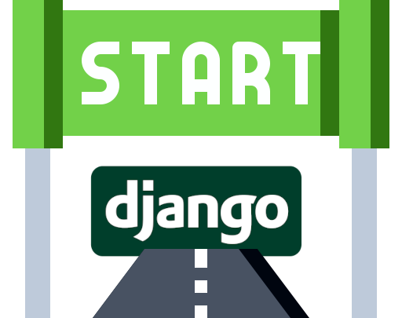

<h1 align="center">
    
</h1>

<h4 align="center">
    My initial configuration to start a django project
</h4>

## Includes
- Model
- Serializer
- Forms
- Templates with Bootstrap
- Admin Dark Mode
- Views (classes and functions)
- API views (DRF)
- Example env.py


### Run
```sh
# clonar repositório
git clone https://github.com/andre23arruda/drf-init

# Entrar na pasta
cd drf-init

# Renomear env_example.py para env.py
cp setup/env_example.py setup/env.py

# Criar um ambiente virtual
python -m venv venv

# Ativar o ambiente virtual
. activate.sh
# ou . venv/Scripts/activate
# ou . venv/bin/activate
# ou source venv/Scripts/activate

# Instalar os pacotes necessários
pip install -r requirements.txt

# Executar as migrações
python manage.py migrate

# Criar superusuário (poderá fazer login e entrar no admin)
. create_su.sh
# username -> teste
# password -> teste1234

# Carregar fixtures (informações para colocar no BD)
python manage.py loaddata genres

# Start
. run.sh
```